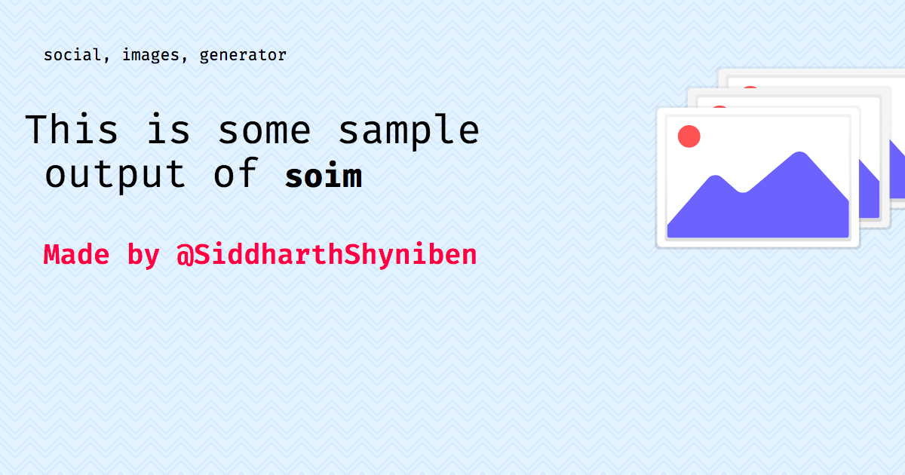

# `soim`


_This image was made by running `soim -t "This is some sample output of <b><code>soim</code></b>" -T "social, images, generator" -i "https://raw.githubusercontent.com/AnandChowdhary/undrawcdn/master/illustrations/images.svg" -c "Made by @SiddharthShyniben" -p "cover.png"`_

`soim` is a CLI tool for generating social images. Given data, `soim` uses
Puppeteer to screenshot a page.

`soim` can also be used as a library. The exported `generateImage` function takes
an object as options, and the options are the same as the CLI options.

## Install

```console
# locally
~$ npm i soim

# globally (for CLI)
~$ npm i -g soim
~$ soim -t ...
```

## CLI options

- `-t`, `--text`: The main text.
- `-T`, `--tags`: Comma separated list of tags, shown at the top of the image
- `-p`, `--path`: The place to write the image
- `-l`, `--link`: Custom link where the social image template lives. Useful if you want to design a custom template. See [the default one](github.com/SiddharthShyniben/social-image-generator) for an example.
- `-i`, `--img`: Link to image shown at the side
- `-c`, `--caption`: Caption of the image
- `-s`, `--deviceScaleFactor`: How much to scale the image
- `-w`, `--width`: Width of image. Suitable for use with `-p`.
- `-h`, `--height`: Height of image. Suitable for use with `-h`.
